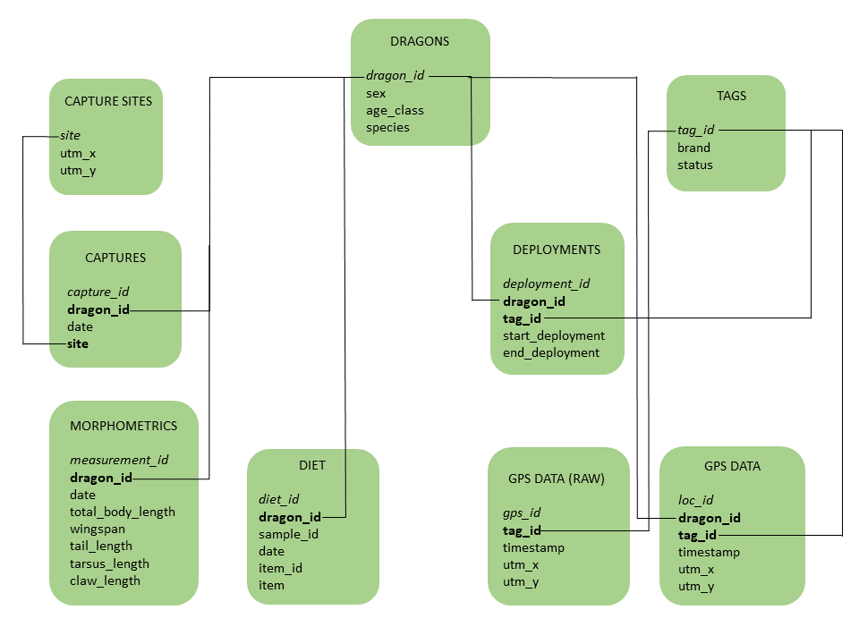

# Database creation {#db}

We collected data of multiple types on dragons in Utah. First, we captured 
dragons at 5 different sites across the state. Some of these dragons were 
equipped with GPS-tracking devices to study their movements. Whenever possible,
we measured dragons before releasing them and collected information on their age
class, species, and sex. We also collected diet samples we found across the 
landscape in the form of regurgitations and classified the single items found 
within each sample. Capture was not necessary to obtain diet samples. 

We used a relational database to house our data. Our database structure looks 
like this:


```{r erd, fig.cap="Diagram of the dragons database", fig.align='center', out.width='80%', echo = FALSE, eval = TRUE}

```

The database is composed of 9 tables. The *dragons* table includes individual 
information on the sample individuals. The *captures* table contains information
on when and where each dragon was captured, and it's linked to the *capture sites*
table which stores the coordinates of each capture site. The *morphometrics* 
table contains body measurements and the *diet* table contains information on 
diet samples. Both of these are linked to the *dragons* table based on 
individual IDs. We also tracked some of these dragons, so we have a *tags* table
which lists all the different GPS units we deployed within the project. The 
*deployments* table tells us which dragon was wearing each tag at any given time,
and therefore it's linked to both the *dragons* and the *tags* table through the
dragon IDs and the tag IDs, respectively. A *raw GPS data* table contains 
telemetry data in its raw form, i.e., as it comes out of the tags, and it's 
therefore linked to the *tags* table via the tag ID. Finally, a *processed GPS data*
table associates the tracking data to the dragons. Primary keys are in italics 
and foreign keys are in bold. Connectors link tables with one another based on 
their foreign keys. 

We created the database in RSQLite. 

```{r dbi2, eval = TRUE, echo = TRUE}
library(DBI)
```

```{r conn2, eval = TRUE, echo = TRUE}
dragons_db <- dbConnect(RSQLite::SQLite(), "../../Course Material/Data/dragons/dragons.db")
```

### Dragons 

First, we created the dragons table, which stores information on every single
dragon individual we have any type of data for:

```{r create-drag, eval = FALSE, echo = TRUE}
dbExecute(dragons_db, "CREATE TABLE dragons (
dragon_id varchar(5) NOT NULL,
sex char(1) CHECK (sex IN ('M', 'F')),
age_class varchar(8) CHECK (age_class IN ('Juvenile', 'Subadult', 'Adult')),
species varchar(50),
PRIMARY KEY (dragon_id)
);")
```

```{r drag-csv, eval = TRUE, echo = TRUE}
dragons <- read.csv("../../Course Material/Data/dragons/dragons.csv", 
                   stringsAsFactors = FALSE) 

names(dragons)
```

```{r drag-names, echo = TRUE, eval = FALSE}

names(dragons)[1] <- "dragon_id"

```

And imported data into it:

```{r write-drag, eval = FALSE, echo = TRUE}

dbWriteTable(dragons_db, "dragons", dragons, append = TRUE)

```

```{r select-drag, eval = TRUE, echo = TRUE}
dbGetQuery(dragons_db, "SELECT * FROM dragons LIMIT 10;")
```

### Tags

Then we created a table that stores information on the GPS tags:

```{r create-tags, eval = FALSE, echo = TRUE}
dbExecute(dragons_db, "CREATE TABLE tags (
tag_id char(6) NOT NULL PRIMARY KEY,
brand varchar(50),
status varchar(20)
);")
```

And imported data into it:

```{r tags-csv, eval = FALSE, echo = TRUE}
tags <- read.csv("../../Course Material/Data/dragons/tags.csv")

dbWriteTable(dragons_db, "tags", tags, append = TRUE)

```

```{r select-tags, eval = TRUE, echo = TRUE}
dbGetQuery(dragons_db, "SELECT * FROM tags LIMIT 10;")
```

### Capture sites

Then, we created a table to store information on the capture sites:

```{r create-capsites, eval = FALSE, echo = TRUE}
dbExecute(dragons_db, "CREATE TABLE capture_sites (
site char(3) NOT NULL PRIMARY KEY,
utm_x double,
utm_y double
);")
```

And imported data into it:

```{r write-capsites,  eval = FALSE, echo = TRUE}
capture_sites <- read.csv("../../Course Material/Data/dragons/capture_sites.csv")

names(capture_sites)[2:3] <- c("utm_x", "utm_y")

dbWriteTable(dragons_db, "capture_sites", capture_sites, append = TRUE)

```

```{r select-capsites, eval = TRUE, echo = TRUE}
dbGetQuery(dragons_db, "SELECT * FROM capture_sites;")
```

### Captures

Then, we created a table that details each capture event:

```{r create-cap, eval = FALSE, echo = TRUE}
dbExecute(dragons_db, "CREATE TABLE captures (
capture_id INTEGER PRIMARY KEY AUTOINCREMENT,
dragon_id varchar(5),
date text,
site char(3),
FOREIGN KEY(dragon_id) REFERENCES dragons(dragon_id)
FOREIGN KEY(site) REFERENCES capture_sites(site)
);")
```

```{r pkey-cap, eval = TRUE, echo = TRUE}
captures <- read.csv("../../Course Material/Data/dragons/captures.csv") 

captures$capture_id <- 1:nrow(captures)

```

```{r mod-cap, eval = FALSE, echo = TRUE}
captures <- captures[, c("capture_id", "dragon", "capture_date", "capture_site")]

```

```{r name-cap, eval = FALSE, echo = TRUE}
names(captures)[2:4] <- c("dragon_id", "date", "site")

```

And imported data into it:

```{r write-cap, eval = FALSE, echo = TRUE}
dbWriteTable(dragons_db, "captures", captures, append = TRUE)

```

```{r select-cap,  eval = TRUE, echo = TRUE}
dbGetQuery(dragons_db, "SELECT * FROM captures LIMIT 10;")
```

### Morphometrics

Then we created a table to store data on morphometric measurements:

```{r write-morph, eval = FALSE, echo = TRUE}
dbExecute(dragons_db, "CREATE TABLE morphometrics (
measurement_id INTEGER PRIMARY KEY AUTOINCREMENT,
dragon_id varchar(5),
date text,
total_body_length_cm float,
wingspan_cm float,
tail_length_cm float,
tarsus_length_cm float,
claw_length_cm float,
FOREIGN KEY (dragon_id) REFERENCES dragons(dragon_id)
);")
```

And imported data into it:

```{r csv-morph, eval = FALSE, echo = TRUE}

# Load csv file
morphometrics <- read.csv("../../Course Material/Data/dragons/morphometrics.csv") 

# Add auto-incremental number
morphometrics$measurement_id <- 1:nrow(morphometrics)

# Re-order columns
morphometrics <- morphometrics[, c("measurement_id", "dragon", "date",
                                   "total_body_length_cm", "wingspan_cm",
                                   "tail_length_cm", "tarsus_length_cm", 
                                   "claw_length_cm")]

# Change column names to match
names(morphometrics)[2] <- "dragon_id"

# Append to database table
dbWriteTable(dragons_db, "morphometrics", morphometrics, append = TRUE)

```

```{r select-morph, eval = TRUE, echo = TRUE}
dbGetQuery(dragons_db, "SELECT * FROM morphometrics LIMIT 10;")
```

### Diet

Then we created a table to store our diet data:

```{r create-diet, eval = FALSE, echo = TRUE}
dbExecute(dragons_db, "CREATE TABLE diet (
diet_id INTEGER PRIMARY KEY AUTOINCREMENT,
dragon_id varchar(5),
sample_id varchar(8),
date text,
item_id integer,
item varchar(50),
FOREIGN KEY (dragon_id) REFERENCES dragons(dragon_id)
);")
```

And imported data into it:

```{r csv-diet, eval = FALSE, echo = TRUE}
diet <- read.csv("../../Course Material/Data/dragons/diet.csv") 

diet$diet_id <- 1:nrow(diet)

diet <- diet[, c("diet_id", "dragon", "sample_id", "sample_dates", "item_id",
                 "item")]

names(diet)[c(2, 4)] <- c("dragon_id", "date")

dbWriteTable(dragons_db, "diet", diet, append = TRUE)

```

```{r select-diet, eval = TRUE, echo = TRUE}
dbGetQuery(dragons_db, "SELECT * FROM diet LIMIT 10;")
```

### Deployments

Then we created a table to store deployment information:

```{r create-deploy, eval = FALSE, echo = TRUE}
dbExecute(dragons_db, "CREATE TABLE deployments (
deployment_id INTEGER PRIMARY KEY AUTOINCREMENT,
dragon_id varchar(5),
tag_id char(6),
start_deployment text,
end_deployment text,
FOREIGN KEY(dragon_id) REFERENCES dragons(dragon_id)
FOREIGN KEY(tag_id) REFERENCES tags(tag_id)
);")
```

And imported data into it:

```{r csv-deploy, eval = FALSE, echo = TRUE}
deployments <- read.csv("../../Course Material/Data/dragons/deployments.csv") 

deployments$deployment_id <- 1:nrow(deployments)

deployments <- deployments[, c("deployment_id", "dragon", "tag", 
                               "start_deploy", "end_deploy")]

names(deployments)[2:5] <- c("dragon_id", "tag_id", "start_deployment", "end_deployment")

dbWriteTable(dragons_db, "deployments", deployments, append = TRUE)

```

```{r select-deploy, eval = TRUE, echo = TRUE}
dbGetQuery(dragons_db, "SELECT * FROM deployments LIMIT 10;")
```

### GPS-tracking data

Then we created a table to store the GPS tracking data as it comes out of the tags:

```{r create-gps-raw, eval = FALSE, echo = TRUE}
dbExecute(dragons_db, "CREATE TABLE gps_data_raw (
gps_id INTEGER PRIMARY KEY AUTOINCREMENT,
tag_id char(6),
timestamp text, 
utm_x double,
utm_y double,
FOREIGN KEY(tag_id) REFERENCES tags(tag_id)
);")
```

And imported data into it:

```{r csv-gps, eval = FALSE, echo = TRUE}
gps_data_raw <- read.csv("../../Course Material/Data/dragons/telemetry_raw.csv") 

gps_data_raw$gps_id <- 1:nrow(gps_data_raw)

gps_data_raw <- gps_data_raw[, c("gps_id", "tag", "timestamp", "x", "y")]

names(gps_data_raw)[c(2, 4, 5)] <- c("tag_id", "utm_x", "utm_y")

dbWriteTable(dragons_db, "gps_data_raw", gps_data_raw, append = TRUE)

```

```{r select-raw, eval = TRUE, echo = TRUE}
dbGetQuery(dragons_db, "SELECT * FROM gps_data_raw LIMIT 10;")
```

Finally, we were able to generate a table that automatically associates raw GPS 
data to the right individual by intersecting the date each location was taken
with the ID of the individual that was wearing that tag at that time:

```{r create-gps, eval = FALSE, echo = TRUE}
dbExecute(dragons_db, "CREATE TABLE gps_data (
loc_id INTEGER PRIMARY KEY,
tag_id char(6),
dragon_id varchar(5),
timestamp text,
utm_x double,
utm_y double,
FOREIGN KEY (tag_id) REFERENCES tags(tag_id)
FOREIGN KEY (dragon_id) REFERENCES dragons(dragon_id)
);")
```

```{r insert-gps, eval = FALSE, echo = TRUE}
dbExecute(dragons_db, "INSERT INTO gps_data (
tag_id, dragon_id, timestamp, utm_x, utm_y)
SELECT
deployments.tag_id,
deployments.dragon_id,
gps_data_raw.timestamp,
gps_data_raw.utm_x,
gps_data_raw.utm_y
FROM deployments LEFT JOIN gps_data_raw USING (tag_id)
WHERE gps_data_raw.tag_id = deployments.tag_id AND
(
    (
    (strftime(gps_data_raw.timestamp) >= strftime(deployments.start_deployment)) AND
    (strftime(gps_data_raw.timestamp) <= strftime(deployments.end_deployment))
    )
OR 
    (
    (gps_data_raw.timestamp >= deployments.start_deployment) AND
    (deployments.end_deployment IS NULL)
    )
);")
```

```{r select-locs, eval = TRUE, echo = TRUE}
dbGetQuery(dragons_db, "SELECT * FROM gps_data LIMIT 10;")
```
